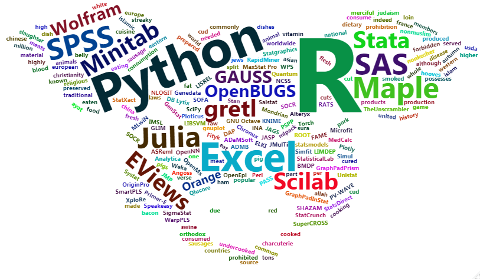
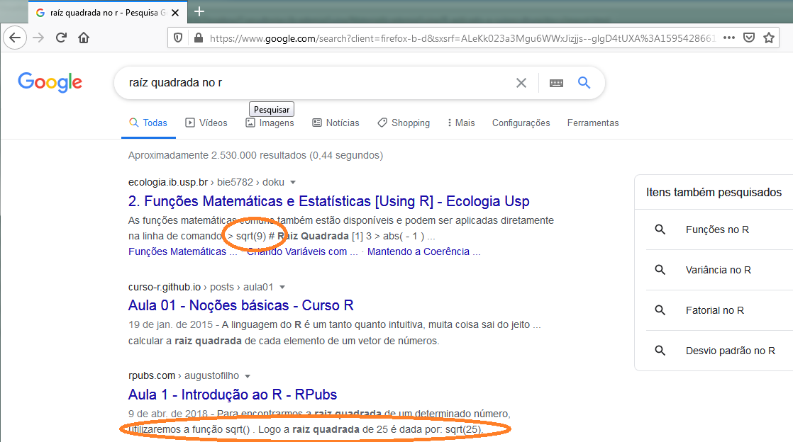
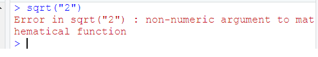
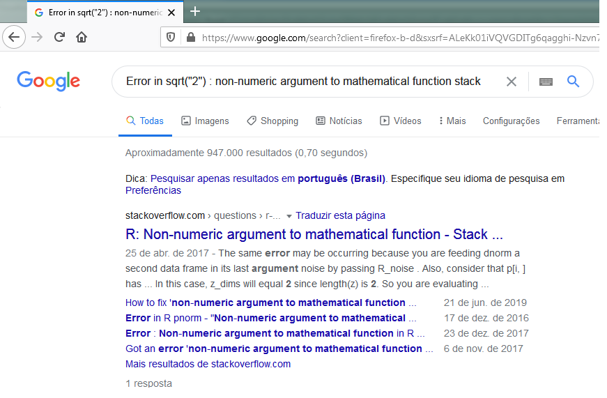
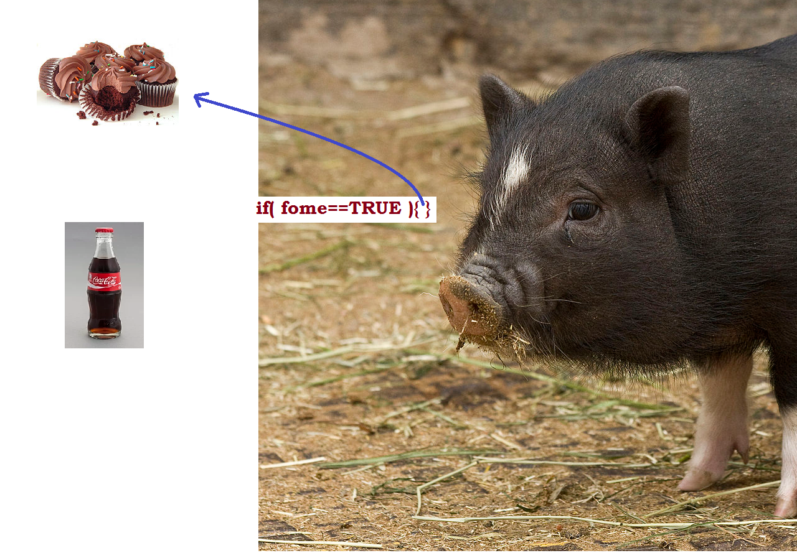

# Tutorial básico `R` e `RStudio` {#tuto}


Existe uma ampla variedade de softwares relacionados à estatística e análise de dados. Uma lista generosa pode ser encontrado em [List of statistical software](https://en.wikipedia.org/wiki/List_of_statistical_software). A seguinte ilustração apresenta os mais populares na visão deste autor.

```{r facepig, echo=FALSE, fig.cap="Lista de softwares mais populares na análise estatística na visão do autor", out.width = '90%'}

```

```{r echo = FALSE,eval=FALSE}
library(readxl)
lista_s=read_excel("Dados/softwares.xlsx")
library(wordcloud)
library(wordcloud2)
wordcloud(lista_s$Soft,freq = lista_s$pop,min.freq = 1,max.words=200, random.order=FALSE, rot.per=0.35,colors=brewer.pal(8, "Dark2"))
```


## Apresentação da linguagem `R` 

`R` é uma linguagem de programação caracterizada como Software Livre sob os termos da _General Public License (GNU)_ da _Free Software Foundation_ no formato _open source_. É voltada a manipulação, análise e vizualização de dados e tem como característica o aspecto colaborativo, sendo que as ferramentas desenvolvidas são compartilhadas online pelos desenvolvedores, podendo ter acesso a elas qualquer pessoa, sem restrições. Uma breve história do R pode ser encontrada no [wikipedia](https://pt.wikipedia.org/wiki/R_(linguagem_de_programa%C3%A7%C3%A3o)).


## Instalando o `R`

Para instalar no computador, o `R` deve ser baixado do  [CRAN](https://cran.r-project.org/).


```{r cran, echo=FALSE, fig.cap="Comprehensive R archive network (CRAN)", out.width = '90%'}
knitr::include_graphics("Figuras/CRAN.png")
```

Se o sistema operacional for Linux, uma versão _base_ do `R` já vem instalada. No cado de outros sistemas operacionais, como o Windows, é necessário instalar o `R` [base](https://cran.r-project.org/bin/windows/base/). 


## Instalando o RStudio

Como quase toda linguagem _Open Source_ a utilização se dá por meio de linhas de comando. Para tornar a linguagem mais amigável aos usuários, várias IDEs (_integrated development environment_) são utilizadas. No caso do `R`, a mais desenvolvida e utilizada é o [RStudio](https://rstudio.com/products/rstudio/). 

Uma versão _Free_ do RStudio para o seu desktop pode ser baixado de [https://rstudio.com/products/rstudio/download/](https://rstudio.com/products/rstudio/download/).

Depois de instalar o `R`, o RStudio já estará integrado ao `R` e terá uma interface intuitiva e amigável ao usuário. 

> *Ainda assim, é importante ressaltar que na linguagem `R` não encontraremos **botões** para realizar as análises.* 

<br>

```{r rstudio, echo=FALSE, fig.cap="Interface do RStudio", out.width = '90%'}
knitr::include_graphics("Figuras/RStudio.png")
```

## Diretório de trabalho

Um ação importante que deve ser realizada pelo usuário é _setar o diretório_ de trabalho.  Para isso existem diferentes formas. Uma delas é usando a função _setwd()_ .

<br>

```{r setwd, echo=TRUE,eval=FALSE}
setwd("~/R aplicado a suinocultura 2")
```

<br>

Outra opção é através do _Go to directory_ que está disponível no Workspace do RStudio, conforme figura \@ref(fig:rstudio2). Nessa opção o usuário escolhe o diretório de trabalho e depois usando a opção _set as working directory_ esse diretório será "_settado_" como diretório de trabalho. 

<br>

> *Todas os arquivos gerados, como figuras serão salvos nesse diretório. Para abrir um conjunto de dados, por exemplo, será muito mais simples se este também estiver salvo no mesmo diretório ou um subdiretório. Além disso, toda vez que o RStudio for reinicializado, esse procedimento terá que ser refeito.* 

<br>

```{r rstudio2, echo=FALSE, fig.cap="Diretório de trabalho"}
knitr::include_graphics(c("Figuras/RStudio2.png","Figuras/RStudio3.png"))
```


## RStudio Cloud

Outra forma simples e prática para usar o `R` e o RStudio é usar o [RStudio Cloud](https://rstudio.cloud/). 

<br>

> _THE MISSION
We created RStudio Cloud to make it easy for professionals, hobbyists, trainers, teachers and students to do, share, teach and learn data science_. [@rstudiocloud]

<br>

```{r rstudiocloud, echo=FALSE, fig.cap="Rstudio Cloud", out.width = c('90%'),fig.show='hold'}
knitr::include_graphics("Figuras/RStudioCloud.png")
```

<br>

Na núvem é possível usar o RStudio utilizando um login através da conta google, ou criar gratuitamente uma conta. Uma vez logado, escolhendo a opção _project_ o usuário terá uma versão do RStudio perfeitamente funcional, que pode ser utilizada até no smartphone. Obviamente, é necessário ter conexão com a internet para que a ferramenta possa ser utilizada. 

<br>

```{r rstudiocloud2, echo=FALSE, fig.cap="Rstudio Cloud", out.width = c('90%'),fig.show='hold'}
knitr::include_graphics("Figuras/RStudioCloud2.png")
```


## Instalação de pacotes 

Na versão _base_ do `R`, uma série de ferramentas, funções e métodos estatísticos são disponibilizados. Além disso, alguns pacotes também compõe a versão _base_ do `R`. Depois de instalado, o usuário pode verificar quais pacotes estão instalados acessando o ícone _Packages_ em _Tools_ ou digitando  *installed.packages()* no _console_.  

Para instalar um novo pacote, o usuário pode acessar  o ícone _Packages_ e depois clicar em _Install_ ou digitar no console _install.packages("nome do pacote")_ . Como exemplo, podemos instalar o pacote usado para vizualização de dados chamado _ggplot2_. 


```{r, eval = FALSE}
install.packages("ggplot2")
```

### Carregando pacotes

Importante para usuários iniciantes na linguagem `R` é entender a diferença entre instalar pacotes e carregar pacotes. Uma vez instalado, o pacote estará a disposição do usuário sempre que ele precisar, mas é necessário carregá-lo. É comum deixar um comando nos _scripts_ para que cada vez que seja necessário usar alguma função específica de um pacote, ele primeiro seja carregado. O comando usado é o _library()_ mas pode ser feito acessando o espaço que chamando de **Tools**, clicar em _Packages_ e marcar o pacote desejado para carregá-lo. 

```{r}
library(ggplot2)
```

## Ajuda

Para um usuário iniciante no `R` é fundamental saber como resolver problemas diversos que certamente vão surgir durante a instalação de um pacote, uso de uma função, criação de um gráfico, manipulação de dados, etc. Muitas coisas no `R` são feitas por tentativa e erro, mas o conhecimento é acumulativo e problemas similares, poderão ter uma solução mais rápida. Uma das grandes vantagens da utilização do `R` é que a comunidade é bastante ativa. Existem diferentes formas de conseguir ajuda e vou elencá-las em ordem de importância, segundo a forma utilização desse autor:

- > Google
- > Stack Overflow
- > Help do R ( `help()` ou `?`)


### Google

Para um iniciante em `R` coisas simples como calcular a raíz quadrada de um número pode ser difícil. Nesses caso o google é muito útil. 
<br>

```{r sq1, echo=FALSE, fig.cap="Rstudio Cloud", out.width = c('90%'),fig.show='hold'}

```

Um pouco de conhecimento de inglês aumenta consideravelmente as opções de ajuda no google. 


### Stack Overflow

Quando o problema parecer um pouco mais complexo, uma opção é colocar a pergunta no google junto com *Stack Overflow*. Isso provavelmente direcionará o usuário para  [Stack Overflow em Português](https://pt.stackoverflow.com/) ou [Stack Overflow ](https://stackoverflow.com/) que são sites de Pergunta e Resposta utilizados por todas as linguagens de programação. 

```{r sq3, echo=FALSE, fig.cap="Rstudio Cloud", out.width = c('90%'),fig.show='hold'}

```

<br> 

```{r sq2, echo=FALSE, fig.cap="Rstudio Cloud", out.width = c('90%'),fig.show='hold'}

```


### Help do `R`
Se o usuário já sabe qual função  deve ser usada, então a documentação do `R` é bem útil. 

```{r eval=FALSE}
?sqrt
help(sqrt)
```
Dicas para uso do `Help`

- Pode-se ir direto aos exemplos que estão no final;
- Identificar os parâmetros (*Arguments*);
- Funções relacionadas podem ajudar, dependendo da necessida.
- *Vignettes*, que são tutorias mais completos, mas somente alguns pacotes possuem. Esses textos podem ser acessados com a função vignette(package = 'nomeDoPacote'). Por exemplo, vignette(package = 'ggplot2')


## Funcionalidades básicas 

Para maior agilidade é importante que o usuário conheça algumas teclas de atalho. Apertando simultaneamente **_Alt + Shift + K_** o usuário tem acesso à uma grande quantidade de atalhos. Ou clicado em _Tools_ no menu de ícones do RStudio. 
Um comando de atalho que destacaria por ser extremamaente útil é o **_Ctrl + Enter_**. Esse comando executa a linha do _script_ em que o cursor está.

Para começar, usaremos o `R` como uma calculadora simples. Execute o código a seguir diretamente do console do RStudio ou no RStudio, escrevendo-os em um script e executando-os usando **_Ctrl + Enter_**.

### Operações básicas

#### As quatro operações 

| Operação      | código `R`| Resultado |
|:-------------:|:-------:|:---------:|
| $3 + 2$       | `3 + 2` | `r 3 + 2` |
| $3 - 2$       | `3 - 2` | `r 3 - 2` |
| $3 \cdot2$    | `3 * 2` | `r 3 * 2` |
| $3 / 2$       | `3 / 2` | `r 3 / 2` |

```{r}
x <- 10
y <- 2

x+y
x-y
x*y
x/y
```
#### Exponenciação 

| Operação      | código `R`| Resultado |
|:-------------:|:-------:|:---------:|
| $3^2$        | `3 ^ 2`         | `r 3 ^ 2`         |
| $2^{(-3)}$   | `2 ^ (-3)`      | `r 2 ^ (-3)`      |
| $100^{1/2}$  | `100 ^ (1 / 2)` | `r 100 ^ (1 / 2)` |
| $\sqrt{100}$ | `sqrt(100)`     | `r sqrt(100)`     |

```{r}
x^y         # x=10 e y=2
```


#### Logarítimos  

Observe que não existe  `ln()` no `R`.  Usa-se `log()` para significar logarítimo natural. Para as demais bases, é necessário especificar a base desejada. 

| Operação      | código `R`| Resultado |
|:------------:|:---------------:|:-----------------:|
| $\log(e)$         | `log(exp(1))`       | `r log(exp(1))`       |
| $\log_{10}(100)$ | `log10(100)`       | `r log10(100)`       |
| $\log_{2}(16)$     | `log2(16)`           | `r log2(16)`           |
| $\log_{4}(16)$    | `log(16, base = 4)` | `r log(16, base = 4)` |

```{r}
log(x)        # x=10
log(x,base=y) # y=2
```

#### Constantes matemáticas  

| Constante     | código `R`| Resultado |
|:------------:|:---------------:|:-----------------:|
| $\pi$        | `pi`            | `r pi`            |
| $e$          | `exp(1)`        | `r exp(1)`        |


```{r}
log(exp(1)) 
exp(1)^y     # y=2
```

### Operadores lógicos


| Operador | Significado              | Exemplo              | Resultado |
|:---------|:---------------------:|:---------------------:|:-------:|
| `x < y`  | `x` menor do que `y`                | `3 < 42`               | `r 3 < 42`               |
| `x > y`  | `x` maior do que `y`             | `3 > 42`               | `r 3 > 42`               |
| `x <= y` | `x` menor ou igual à `y`    | `3 <= 42`              | `r 3 <= 42`              |
| `x >= y` | `x` menor ou igual à`y` | `3 >= 42`              | `r 3 >= 42`              |
| `x == y` | `x` igual à `y`                  | `3 == 42`              | `r 3 == 42`              |
| `x != y` | `x` diferente de `y`             | `3 != 42`              | `r 3 != 42`              |
| `!x`     | não `x`                          | `!(3 > 42)`            | `r !(3 > 42)`            |
| `x | y`  | `x` ou `y`                       | `(3 > 42) | TRUE`      | `r (3 > 42) | TRUE`      |
| `x & y`  | `x` e `y`                      | `(3 < 4) & ( 42 > 13)` | `r (3 < 4) & ( 42 > 13)` |

#### Operador lógico _if()_
Dentro dessa classe de operadores, podemos destacar o operador _if()_. É comum usar esse operador para testar condições únicas ou múltiplas na instrução _if()_ ou  _ifelse()_. Operadores lógicos em `R` podem ser aplicados a vetores numéricos ou complexos ou objetos booleanos, que são **TRUE** ou **FALSE** (à eles são reservados os _atalhos_ **T** e **F**).

```{r pigif, fig.align='center',out.width="80%",fig.cap="Operador lógico *if()* - Fonte Imagens: Wikipedia "}

```

```{r}
A=4
B=2
if(A>B){
  print("A é maior do que B")
  }else{
    print("A não é maior do que B")
  }
```

```{r}
A=4
B=6
if(A>B){
  print("A é maior do que B")
  }else{
    print("A não é maior do que B")
  }
```


Outra forma simples de usar o operador é:

```{r}
A=4
B=6
A>B
```
#### Operador lógico _ifelse()_

O operador _ifelse( "1", "2" , "3")_ possui 3 entradas. Na primeira "1", deve-se colocar a condição a ser testada. Em "2" o resultado caso a condição testada seja verdadeira e em "3" o resultado, caso a condição testada seja falsa. 


```{r ch666}
A=4
B=6
#ifelse(A>=B,"Verdadeiro","FALSO")
```


#### Operadores de atribuição

Os operadores de atribuição são provavelmente a família de operadores que você mais usará enquanto
trabalha com `R`. Como o nome desse grupo implica, eles são usados para atribuir objetos, como
valores numéricos, _strings_, vetores, modelos e plotagens para um nome (variável). Isso inclui
operadores como a seta para trás (<-) ou o sinal de igual (=)

```{r oa}
str <- "Em Brasília, 19 horas!" # String
int <- 10 # Inteiro
vet <- c(1,2,3,4) # Vetor
```

<br>

Para visualizar a variável, podemos simplesmente digitá-la ou usar a função *print()*
 
```{r oa1}
str
#ou
print(str)
```

<br>

Para visualizar mais de uma variável, podemos usar "c()" para "juntar as variáveis"

```{r oa2}
c(str,int)
# ou
print(c(str,int))
```

> _Esse exemplo pode ser repetido usando "=" no lugar de "<-"_


<br> 

### Tipos de dados
`R`  possui um número básico de *tipos* de dados. Enquanto o `R`é uma _linguagem fortemente tipada_ (não exige do usuário muito conhecimento sobre diferentes tipos de dados) é útil conhecer os tipos disponíveis. 


- Numeric
    - Também conhecido como duplo. O tipo padrão ao lidar com números.
    - Exemplos: `1`,` 1,0`, `42,5`
- Integer
    - Exemplos: `1L`,` 2L`, `42L`
- Complex
    - Exemplo: `4 + 2i`
- Logical
    - Dois valores possíveis: `TRUE` e `FALSE`
    - Você também pode usar `T` e`F`, mas isso *não* é recomendado.
    - `NA` também é considerado lógico.
- Character
    - Exemplos: `" a "`, `" Statistics "`, `" 1 mais 2. "`
- Categorical or `factor`
    - Uma mistura de número inteiro e caractere. Uma variável `fator` atribui um rótulo a um valor numérico.
    - Por exemplo, `fator (x = c (0,1), labels = c (" male "," female ")))` atribui a string *male* aos valores numéricos `0` e a string *female* ao valor `1`.


### Valores especiais

Assim como `TRUE` e `FALSE`, existem outros *valores* reservados à situações específicas.


- `NA` (*Not Available*) representa dado faltante (não disponível), ou que que é chamado em estatística de *missing data*.
- `NaN` (*Not a Number*) são gerados quando temos uma indefinições matemáticas, como sqrt(-1) e 0/0. 
- `Inf` (*Infinito*) é usado quando o valor numérico é muito grande (limite). Por exemplo, `exp(2000)`.
- `NULL` significa ausência de informação. Parecido com o `NA`, mas conceitualmente mais usado na lógica de programação. 

As funções `is.na()`, `is.nan()`, `is.infinite()` e `is.null()`podem ser usadas para verificar se um objeto possui algum valor com essa caraterística. 


## Estrutura dos dados

`R` também possui um número básico de *estrutura* de dados. Essa estrutura de dados pode ser **homogênea** ( setodos os elementos são do mesmo tipo de dados) ou **heterogênea** (se os elementos podem ter mais de um tipo de dados).


| Dimensão | **Homogênea** | **Heterogênea** |
|:---------:|:---------------:|:-----------------:|
| 1         | Vector          | List              |
| 2         | Matrix          | Data Frame        |
| 3+        | Array           |    nested Lists   |


### Vetores

Muitas operações em `R` usam **vetores**. Um vetor contém um conjunto de objetos de tipos identicos e são indexados começando na posição `1`. A maneira mais comum para se criar um vetor é usar a função `c()`, o que é uma abreviação de `combine()`. Ela combina uma lista de elementos separados por `,`.  Por exemplo,

```{r}
c(1,2)
```

Ou podemos combinar outros objetos, desde que sejam do mesmo tipo.

```{r}
A=c(1,2)
B=c(3,4,5)
c(A,B)
```

Os objetos não precisam ser numéricos. Por exemplo,

```{r}
A="Amarelo"  # objeto da classe "character"
class(A)
B="Azul"
c(A,B)
```
Embora tenham muitas `letras` nesse objeto combinado `c(A,B)`, na verdade só existem dois elementos, {"Amarelo", "Azul"}. Para acessá-los, usamos o colchete `[]`. 

#### Subconjuntos de vetores


Para subconjunto de um vetor, ou seja, para escolher apenas alguns elementos dele, usamos colchetes, `[]`. Aqui vemos que `AA[1]` retorna o primeiro elemento e `AA[2]` retorna o segundo elemento:


```{r}
A="Amarelo"
B="Azul"
AA=c(A,B)
AA[1]
AA[2]
```

Qunado o vetor é maior, podemso usar um conjunto de indices para acessar o valores correspondentes no vetor.

```{r}
x=c(35,42,47,54,70,75)
x[c(1,3,6)]     # Acessa as posições 1, 3 e 6 do vetor
x[-4]           # Acessa todas as posições do vetor, menos a posição 4
```


Muitas vezes queremos criar um vetor baseado em uma sequência de números. No `R` o operador `:` é usado como uma opção `de : até `. Dessa forma é possível usá-lo em diferentes situações. 


```{r}
c(1:10) # vetor com números de 1 à 10
1:10    # vetor com números de 1 à 10
```

Outros vetores de objetos são possíveis de criar 

```{r}
LETTERS[1:4] # maiúsculas
letters[1:4] # minuscúlas
```

#### Função `paste()`

Com a função `paste()` podemos concatenar objetos de tipos diferentes e armazená-los em um vetor.

```{r}
paste("Porco_", letters[1:4], sep="")   # Underline no Porco e sem espaço no sep
paste("Porco", letters[1:4], sep="_")   # Underline no sep
p=paste("Porco", letters[1:4], sep="_") # Armazenando no vetor p
p[2]                                    # Acessando a posição 2 do vetor p
```

Note que escalares não existem no `R`. Eles são vetores de tamanho `1`.


```{r}
2
```

#### Função `seq()` 
Se quisermos criar uma sequência que não se limite a números inteiros e que aumente 1 por vez, podemos usar a função `seq()`.

```{r}
seq(from = -0.5, to = 1.8, by = 0.1)
```


#### Função `rep()` 


Outra operação comum para criar um vetor é `rep()`, que pode repetir um único valor várias vezes.

```{r}
rep("A", times = 10)
rep(1, 10)
```


A função `rep()` pode ser usada para repetir um vetor várias vezes.

```{r}
x=c("O","A")
rep(x, 3)
```


#### Função `length()`

Uma função importante é à que identifica o tamanho do vetor, que é a função  `length()`.

```{r}
x=1:5
length(x)
y=rep(x,6)
length(y)
```


#### Resumo

temos quatro formas de criar vetores

- `c()`
- `:`
- `seq()`
- `rep()`


#### Operações com vetores

O `R` é capaz de executar muitas operações em vetores e escalares.

```{r}
x = 1:10  # Um vetor
x + 1     # Soma um escalar à cada elemento do vetor
2 * x     # Multiplica todos os elementos por 2
2 ^ x     # Eleva 2 na potência correspondente a cada elemento de x
sqrt(x)   # Calcula a raíz quadrada de cada elemento de x
log(x)    # Calcula o log natural de cada elemento de x
```

We see that when a function like `log()` is called on a vector `x`, a vector is returned which has applied the function to each element of the vector  `x`.


#### Operadores lógicos com vetores

Em `R`, operadores lógicos também funcionam com vetores:

```{r}
x = c(5,3,1,9,27,90)
```

```{r}
x == 9
x != 9
x > 9
x < 9

```

```{r}
x == 9 & x != 9
x == 9 | x != 9
```

Outra operação importante que podemos destacar

```{r}
x[x > 9]
x[x != 9]
```


```{r}
sum(x > 9)
as.numeric(x > 9)
```

Usamos a função `sum()` em um vetor de valores lógicos `TRUE` e `FALSE` ( resultado de `x>3`) e resultado foi um valor numérico. A operação apenas *contou* quantos vezes `x>3` resultou em `TRUE`. Durante a chamada de `sum()`, o `R` primeiro *coerce* (*força*)  automaticamente o lógico para numérico, em que `TRUE` é `1` e `FALSE` é `0`. Essa coerção do lógico para o numérico acontece na maioria das operações matemáticas.

#### Função `which()`

```{r}
# which (dondição de x) retorna verdadeiro / falso
# cada índice de x em que a condição é verdadeira
x = c(5,3,1,9,27,90)
which(x > 9)
x[which(x > 9)]
max(x)
which(x == max(x))
which.max(x)
```

### Tarefa 2

1. Crie um vetor preenchido com 10 números sorteados na distribuição uniforme discreta em {1,2,3,4,5,6} (dica: use a função `sample()`) e armazene-os em `x`.
1. Usando o subconjunto lógico como acima, obtenha todos os elementos de `x` maiores que 2 e armazene-os em` y`.
1. Usando a função `which`, armazene os *índices* de todos os elementos de `x` que são maiores que 2 em `iy`.
1. Verifique se `y` e `x[iy]` são idênticos.


### Matrizes

O `R` também pode ser usado para cálculos de **matriz**. Matrizes têm linhas e colunas contendo um único tipo de dados. Em uma matriz, a ordem das linhas e colunas é importante. (Isso não se aplica à *dataframe*, que é um outro tipo de dado que veremos mais adiante).

Matrizes podem ser criadas usando a função `matrix`.

```{r}
x = 12:1
x
X = matrix(x, nrow = 3, ncol = 4)
X
```

Note que o `R` é **case sensitive** (`x` vs `X`).

Por padrão, a função `matrix` preenche seus dados na matriz coluna por coluna. Mas também podemos dizer ao `R` para preencher as linhas:

```{r}
W = matrix(x, nrow = 3, ncol = 4, byrow = TRUE)
W
```

Também podemos criar uma matriz de uma dimensão especificada onde cada elemento é o mesmo, neste caso, `0`.

```{r}
Y = matrix(0, 2, 3)
Y
```


#### Matriz diagonal
Para criar uma matriz diagonal podemos usar a função `diag()`

```{r}
diag(4)   # cria matriz identidade 4x4
diag(4,5) # cria uma matriz digonal 4x4, em que os elementos da diagonal são 5
```

Como vetores, matrizes podem ser acessadas usando colchetes, `[]`. No entanto, como as matrizes são bidimensionais, precisamos especificar uma linha e uma coluna ao fazer o subconjunto.
```{r}
X
X[1, 2] # primeira linha e na segunda coluna
```
 Também podemos acessar uma linha ou coluna inteira.

```{r}
X[1, ]
X[, 2]
```

#### Elementos da matriz
Também podemos usar vetores para acessar subconjunto com mais de uma linha ou coluna por vez. Aqui acessamos à primeira e terceira coluna da segunda linha:

```{r}
X[2, c(1, 3)] # segunda linha, primeira e terceira coluna
```

```{r}
X[c(2,1), c(1, 3)] # segunda e priemira linha, primeira e terceira coluna
```


#### Funções `rbind()` e  `cbind`
As matrizes também podem ser criadas combinando vetores como colunas, usando `cbind`, ou combinando vetores como linhas, usando `rbind`.

```{r}
x = 1:4
rev(x)
rep(1,4)
```

```{r}
rbind(x, rev(x), rep(1, 4))
```

```{r}
cbind(col_1 = x, col_2 = rev(x), col_3 = rep(1, 4))
```

Ao usar `rbind` e` cbind`, você pode especificar nomes de "argumentos" que serão usados como nomes de colunas.


#### Operações com Matrizes
O `R` pode então ser usado para realizar cálculos de matriz.

```{r}
x = 1:12
y = 12:1
X = matrix(x, 3, 4)
Y = matrix(y, 3, 4)
X
Y
```

```{r}
X + Y   # Soma elemento por elemento
X - Y   # Subtração elemento por elemento
X * Y   # Multiplicação elemento por elemento
X / Y   # Divisão elemento por elemento
```


Note que `X * Y` **não** é multiplicação de matrizes. É multiplicação de *elemento por elemento*. (O mesmo para `X/Y`).

Para a multiplicação de matrizes usa-se `%*%`. Outras funções para operações com matrizes são `t()`, que fornece a transposição de uma matriz e `solve()`, que retorna a inversa de uma matriz quadrada, se for invertível.

```{r}
x = 1:9
y = 9:1
X = matrix(x, 3, 3)
Y = matrix(y, 3, 3)
X %*% Y
t(X)
```

### Arrays

Um vetor é um `array` unidimensional. Uma matriz é um `array` bidimensional. Em `R`, o usuário pode criar `arrays` de dimensionalidade arbitrária `N`. Por exemplo:

```{r}
A = 1:16
B = array(data = A,dim = c(4,2,2))
C = array(data = A,dim = c(4,2,2,3))  # Recicla A=1:16
B
```


Note que `B` são simplesmente *duas*  matrizes (4,2) armazenadas como *páginas* em um mesmo objeto/variável. Similarmente, `C` teria duas *páginas* e mais 3 registros em uma quarta dimensão. E assim por diante.

Para acessar esses elementos, o procedimento é similar ao de uma matriz ou um vetor, cuidando para indexar cada dimensão:

```{r}
B[ ,1,1]    # Todos os elementos da col 1, página 1 
B[2:3, , ]  # Linhas 2:3 de todas as páginas e colunas
B[2,2, ]    # linha 2, coluna 2 de todas as páginas.
```


#### Tarefa 3

1. Crie um vetor contendo `1,2,3,4,5` chamado-o de v.
1. Crie uma matriz (2,5) `m` contendo os dados `1,2,3,4,5,6,7,8,9,10`. A primeira linha deve ser "1,2,3,4,5".
1. Realize a multiplicação da matriz de `m` com `v`. Use o comando `%*%`. Qual a dimensão da saída?
1. Por que `v%*% m` não funciona?


### Listas


Uma lista é uma estrutura de dados unidimensional *heterogênea*. Portanto, é indexado como um vetor com um único valor inteiro (ou com um nome), mas cada elemento pode conter um elemento de qualquer tipo. As listas são semelhantes a um objeto `python` ou `julia`.


```{r rablista, echo=FALSE, fig.cap="Lista de supermercado do Rabicó", out.width = '90%'}

```


Muitas estruturas e saídas do `R` são listas. As listas são objetos extremamente úteis e versáteis; portanto, é interessante entender sua utilização:

```{r}
# Listas simples sem nomes nas entradas
list(12, "Bom dia", TRUE)
# Listas com nome para cada entrada
lista1 = list(
  a = c(1, 2, 3, 4),
  b = TRUE,
  c = "Bom dia!",
  d = function(arg = 10) {print("Em Brasília, 19h!")},
  e = diag(4)
)
```


Os elementos das listas podem ser acesados usando duas sintaxes, o operador `$` e colchetes `[]`. O operador `$` retorna um elemento **nomeado** de uma lista. A sintaxe `[]` retorna uma **lista**, enquanto a `[[]]` retorna um **elemento** de uma lista.

- `lista1[1]` retorna uma lista que contém o primeiro elemento
- `lista1[[1]]`  retorna o primeiro elemento da lista, neste caso, um vetor.

```{r}
# elementos da lista
lista1$e
lista1[[1:2]]
lista1[c("e", "a")]
lista1["e"]
lista1[["e"]]
lista1$d
lista1$d(arg = 1)
```

#### Tarefa 4 {-}

1. Copie e cole o código acima para `list1` na sua sessão do `R`. Lembre-se de que `list` pode conter qualquer tipo de objeto `R`. Como por exemplo, outra lista! Portanto, crie uma nova lista `lista2` que tenha dois campos: o primeiro campo chamado `"Isso"` com o conteúdo da string `"é impressionante"` e um segundo campo chamado `"lista"` que contém `lista1`.
1. Acessar os elementos é como em uma lista simples, apenas com várias camadas agora. Obtenha o elemento `c` de `lista1` em `lista2`!
1. Componha uma nova string com primeiro elemento em `lista2`, o elemento sob o rótulo `"Isso"`. Use a função `paste` para imprimir `R é impressionante` na tela.


## Programação básica

Nesta seção, ilustramos alguns conceitos gerais relacionados à programação.

### Variáveis

 Na programação, uma variável  denota um *objeto*. Outra maneira de dizer isso é que uma variável é um nome ou um *label* para algo:

```{r}
x = 2
y = "doce"
z = function(x){log(x)}
```


Aqui, `x` se refere ao valor `2`, `y` refere-se a *string* "doce" e `z` é o nome de uma função que calcula $\log{x}$. Observe que o argumento `x` da função é diferente do `x` que acabamos de definir.

```{r}
x
z(9)
z(x)
```


### Laços (*Loops*), `for` e `while`


Laços (*Loops*) são uma construção de programação muito importante. Como o nome sugere, em um *loop*, a programação *repetidamente* circula um conjunto de instruções, até que alguma condição diga para parar. Uma construção muito poderosa, porém simples, é que o programa pode *contar quantas etapas* já executou - o que pode ser importante saber para muitos algoritmos. Uma forma de fazer um *loop* é o usando o `for` . 

#### Uso do `for()`

Por exemplo, para executar uma tarefa 3 vezes, usamos 


```{r}
for (i in 1:3){
  print(i)
}
```

A iteração pode ser feita sobre um vetor qualquer de objetos

```{r}
for (i in c("milho","soja","trigo")){
  print(paste("Produção de ",i))  # a função paste() conecta as strings
}
```

Podemos fazer *loops* dentro de *loops* (*nested loops*)

```{r}
for (i in 2:3){
  # primeiro: para cada i
  for (j in c("milho","soja","trigo")){
    # segundo: para cada j 
    print(paste("Usar",i,"Kg de",j,"na fórmula."))
  }
}
```

#### Uso do `while()`

A função `while()`, como o próprio nome sugre, é usada para executar uma tarefa até que uma certa condição aconteça, ou enquanto certa condição não aconteça.


```{r}
Kg=27
while(Kg<30){
  print(paste("Peso é",Kg)) # Enquanto peso é menor do que 30, executa
  Kg=Kg+1 # Enquanto peso é menor do que 30, soma 1 no peso atual
}
```


## Funções

Até agora, usamos funções, mas na verdade não discutimos alguns de seus detalhes. Uma função é um conjunto de instruções que o `R` executa para nós, como as coletadas em um arquivo *script*. O bom é que as funções são muito mais flexíveis que os scripts, pois podem depender de *argumentos de entrada*, que alteram a maneira como a função se comporta. Aqui está como definir uma função:

```{r eval=FALSE}
nome_da_funcao <- function(arg1,arg2=valor_padrao){
  # corpo da função
  # faça coisas com arg1 e arg2
  # a última linha será retornada
}
```

Um exemplo de uma função símples

```{r}
 fun1<- function(seu_nome = "Baby"){
  paste("Seja bem vindo ao R,",seu_nome)
  # pode-se escrever também
  # return(paste("Seja bem vindo ao R,",seu_nome))
}
#chamando a função sem nenhum argumento, o argumento seu_nome padrão será Baby
fun1()
```

Agora tente com o seu nome:

```{r}
fun1("Rabicó")
```

Just typing the function name returns the actual definition to us, which is handy sometimes:

```{r}
fun1
```

Funções são maneiras de dizer ao `R` o que deve ser feito. É como se ensinássemos uma tarefa ao software para que ele passe a executá-la sempre que solicitado. Um dica para não acumular erros durante a programação é dividir o *script* em várias funções. Quando se tem um conjunto de funções que realiza um conjunto de tarefas mais amplas, pode-se juntar tudo em um pacote (`package`), submeter ao `CRAN` para disponibilizar à comunidade. 

#### Tarefa 6 {-}

1. Escreva um _loop_ `for` para escrever o seu nome, letra por letra. Comece com um vetor com as letras do seu nome. 
1. Modifique esse *loop* para que cada iteração leve aproximadamente um segundo. Você pode conseguir isso adicionando o comando `Sys.sleep(1)` abaixo da linha que imprime "iteração i nome_parcial", em que `i` é a correspondente iteração no _loop_.

## Operador `Pipe` 

Para manipulação de dados é interessante conhecer a lógia do operador `pipe`,  `%>%`. Vários pacotes são construídos em cima dessa lógica, que busca encadear ações do `R` de uma forma mais compreensível. Vamos instalar o pacote `magrittr` para começar a usar `%>%`.

```{r eval=FALSE}
install.packages("magrittr")
library(magrittr)
```
```{r echo=FALSE}
library(magrittr)
```

Vejamos como funciona.
```{r eval=FALSE}
sin(cos(pi))
pi%>%cos%>%sin
```

Ambas as expressões acima são equivalentes. Parece redundante e que não se tem nehuma vantagem ao usar o `%>%`. No entanto, para um caso envolvendo dados reais, podemos verificar sua utilidade

```{r echo=FALSE}
library(readxl)
id=read_excel("Dados/dados_idades_dietas.xlsx",sheet = 1)
``` 

```{r }
head(id)

id%>%na.omit%>%lm(GPDacumulado ~ id$Dieta+ConsumoAcumulado, data = .) %>% summary
``` 
