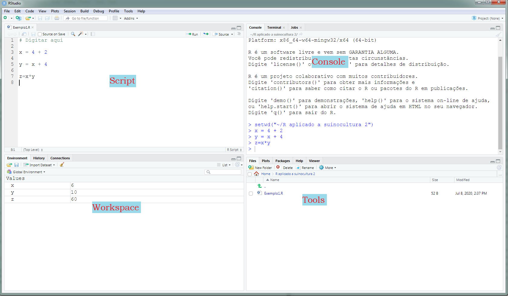

# Tutorial básico R e RStudio {#tuto}

## Apresentação da linguagem R 

R é uma linguagem de programação caracterizada como Software Livre sob os termos da _General Public License (GNU)_ da _Free Software Foundation_ no formato _open source_. É voltada a manipulação, análise e vizualização de dados e tem como característica o aspecto colaborativo, sendo que as ferramentas desenvolvidas são compartilhadas online pelos desenvolvedores, podendo ter acesso a elas qualquer pessoa, sem restrições. Uma breve história do R pode ser encontrada no [wikipedia](https://pt.wikipedia.org/wiki/R_(linguagem_de_programa%C3%A7%C3%A3o)).


## Instalando o R

Para instalar no computador, O R deve ser baixado do [CRAN](https://cran.r-project.org/).


```{r cran, echo=FALSE, fig.cap="Comprehensive R archive network (CRAN)", out.width = '90%'}
knitr::include_graphics("Figuras/CRAN.png")
```

Se o sistema operacional for Linux, uma versão _base_ do R ja vem instalada. No cado de outros sistemas operacionais, como o Windows, é necessário instalar o R [base](https://cran.r-project.org/bin/windows/base/). 


## Instalando o RStudio

Como quase toda linguagem _Open Source_ a utilização se dá por meio de linhas de comando. Para tornar a linguagem mais amigável aos usuários, várias IDEs (_integrated development environment_) são utilizadas. No caso do R, a mais desenvolvida e utilizada é o [RStudio](https://rstudio.com/products/rstudio/). 

Uma versão _Free_ do RStudio para o seu desktop pode ser baixado de [https://rstudio.com/products/rstudio/download/](https://rstudio.com/products/rstudio/download/).

Depois de instalar o R, o RStudio já estará integrado ao R e terá uma interface intuitiva e amigável ao usuário. 

> Ainda assim, é importante ressaltar que na linguagem R não encontraremos _botões_ para realizar as análises. 

<br>

```{r rstudio, echo=FALSE, fig.cap="Interface do RStudio", out.width = '90%'}

```

## Diretório de trabalho

Um ação importante que deve ser realizada pelo usuário é _setar o diretório_ de trabalho.  Para isso existem diferentes formas. Uma delas é usando a função _setwd()_ .

<br>

```{r setwd, echo=TRUE,eval=FALSE}
setwd("~/R aplicado a suinocultura 2")
```

<br>

Outra opção é através do _Go to directory_ que está disponível no Workspace do RStudio, conforme figura \@ref(fig:rstudio2). Nessa opção o usuário escolhe o diretório de trabalho e depois usando a opção _set as working directory_ esse diretório será "_settado_" como diretório de trabalho. 

<br>

> Todas os arquivos gerados, como figuras serão salvos nesse diretório. Para abrir um conjunto de dados, por exemplo, será muito mais simples se este também estiver salvo no mesmo diretório ou um subdiretório. Além disso, toda vez que o RStudio for reinicializado, esse procedimento terá que ser refeito. 

<br>

```{r rstudio2, echo=FALSE, fig.cap="Diretório de trabalho", out.width = c('46%','46%'),fig.show='hold'}
knitr::include_graphics(c("Figuras/RStudio2.png","Figuras/RStudio3.png"))
```


## RStudio Cloud

Outra forma simples e prática para usar o R e o RStudio é usar o [RStudio Cloud](https://rstudio.cloud/). 

<br>

> _THE MISSION
We created RStudio Cloud to make it easy for professionals, hobbyists, trainers, teachers and students to do, share, teach and learn data science_. [@rstudiocloud]

<br>

```{r rstudiocloud, echo=FALSE, fig.cap="Rstudio Cloud", out.width = c('90%'),fig.show='hold'}

```

<br>

Na núvem é possível usar o RStudio utilizando um login através da conta google, ou criar gratuitamente uma conta. Uma vez logado, escolhendo a opção _project_ o usuário terá uma versão do RStudio perfeitamente funcional, que pode ser utilizada até no smartphone. Obviamente, é necessário ter conexão com a internet para que a ferramenta possa ser utilizada. 

<br>

```{r rstudiocloud2, echo=FALSE, fig.cap="Rstudio Cloud", out.width = c('90%'),fig.show='hold'}
knitr::include_graphics("Figuras/RStudioCloud2.png")
```


## Instalação de pacotes 

Na versão _base_ do R, uma série de ferramentas, funções e métodos estatísticos são disponibilizados. Além disso, alguns pacotes também compõe a versão _base_ do R. Depois de instalado, o usuário pode verificar quais pacotes estão instalados acessando o ícone _Packages_ n


## Funcionalidades básicas 

### Operações
### Operadores lógicos

## Variáveis no R

### Operações

## Vetores

### Operações com vetores


## Matrizes    

### Operações com Matrizes

## Uso do for (loop)

## Funções


