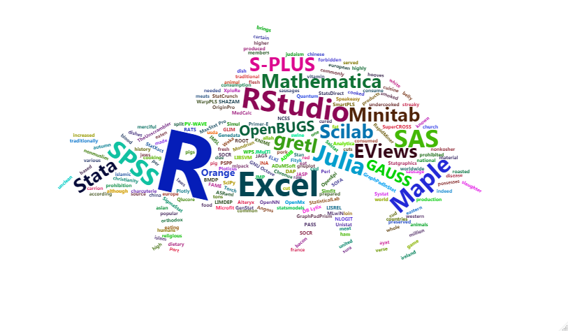
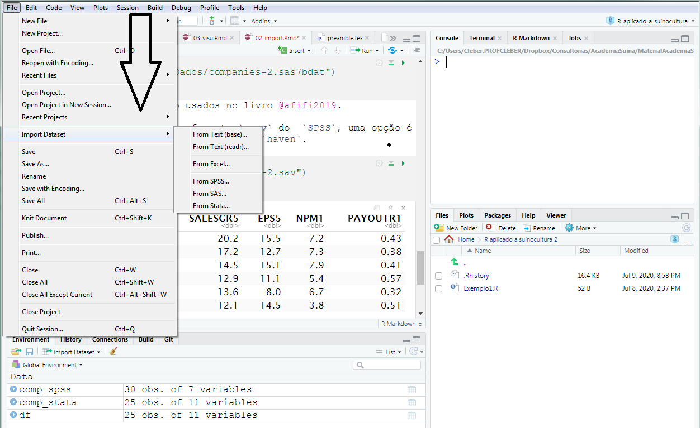

# Importando dados {#import}

Objetivo deste capítulo é mostrar algumas formas de importação de dados. Para usar as ferramentas que o `R` disponibiliza é importante que o usuário consiga carregar os dados e deixá-los em um formato adequado para que o `R` faça a sua mágica. 

```{r piglo, echo=FALSE, fig.cap="Loading", out.width = '90%'}

```

Em um primeiro momento, trabalharemos com **dados delimitados**, que facilita para o usuário iniciante, manipular, selecionar e remover colunas, agrupar, filtrar, mudar a estrutura e o formato dos dados para que seja possível fazer operações básicas, gráficos e análises. 

## Dados de diferentes formatos

### Dados no formato `.txt`

Dados no formato `.txt` podem ser facilmente importados. Os dados que serão carregados para exemplo estão dentro de uma pasta chamada `Dados` no diretório de trabalho setado previamente usando o `setwd()`. A primeira forma de carregar um arquivo `.txt` é usando a função `read.table()`.
```{r}
MG_txt=read.table("Dados/MorningGlory.txt")
head(MG_txt)
``` 
Podemos observar que as colunas não foram nomeadas adequadamente. Podemos resolver isso usando o argumento `header = TRUE`

```{r}
MG_txt=read.table("Dados/MorningGlory.txt",header = TRUE)
head(MG_txt)
``` 
Nesse exemplo os dados estão separados por tabulação. Caso a separação fosse por `,` poeríamos usar o argumento `sep=","`. Os dados do exemplo `MorningGlory` estão publicados em @sreng2020. 

Podemos manipular os dados que estão na variável `MG_txt` e salvar em um arquivo `.txt`. Vamos retirar algumas colunas da variável `MG_txt`.

```{r}
colnames(MG_txt)[5:12]
MG1<-MG_txt[,-c(5:12)]
colnames(MG1)
write.table(MG1, file="Dados/MG1.txt",sep=";")
``` 

A função `write.table()` irá salvar a variável `MG1` em um arquivo `MG1.txt` em que os dados estarão separados por `;`. 

### Dados no formato `.csv`

A função `read.csv` funciona de forma bem semelhante à `read.table()`. Ambas podem ser usadas para carregar um arquivo `.csv`.


```{r}
#gas2=read.table("Dados/gas2.csv",header = TRUE,sep=";")
gas2_csv=read.csv("Dados/gas2.csv",header = TRUE,sep=";")
head(gas2_csv)
``` 

Os dados do arquivo `gas2.csv` podem ser encontrados em @Brambillasca2019.


### Dados no formato `.xls` e `.xlsx`

Para ler dados nos formatos `.txt` e `.csv` o `R` possui funções nativas. No entanto, para demias formatos, será necessário instalar pacotes. 


> *A maneira de importar dados não necessariamente será única. Apresentaremo uma forma de trabalhar com os diferentes formatos. No entanto, o pacote `readr`, por exemplo, pode fornecer recursos mais otimizados.*


Para importar dados nos formatos `.xls` e `.xlsx` será necessário instalar o pacote `readxl` e então carregá-lo.

```{r eval=FALSE}
install.packages("readxl")
library(readxl)
``` 


Para ler os dados no formato `.xls` ou `.xlsx` a função `read_excel()` pode ser usada.  

```{r}
library(readxl)
gas_xlsx=read_excel("Dados/gas.xlsx",sheet = 3)
head(gas_xlsx)
``` 

Nesse exemplo carregamos a *aba* 3 da planilha `gas.xlsx`.

### Dados de um repositório web

Dodos em repositório da web podem ser baixados diretamente com o `R`. Os dados do exemplo anterior (@Brambillasca2019) podem ser carregados usando-se a função `download.file()`

```{r eval=FALSE}
temp = tempfile(fileext = ".xlsx")
dataURL <- "http://data.mendeley.com/datasets/33shf74zn6/1/files
/89c793ba-231e-45c9-9425-95da36fc8c14/data%20in%20vitro%20starch%20and%20gas.xlsx?dl=1"
download.file(dataURL, destfile=temp, mode='wb')
gasw_xlsx <- read_excel(temp, sheet =3)
head(gasw_xlsx)
```

```{r echo=FALSE}
suppressMessages(library("haven"))
load("Dados/gasw")
head(gasw)
gasw_xlsx=gasw
```


### Dados do `SAS`, `SPSS` e `STATA`

Dados do `SAS` podem ser carregados usando as funções do pacote `haven`. 

```{r eval=FALSE}
install.packages("haven")
library("haven")
```


```{r}
comp_sas <- read_sas("Dados/companies-2.sas7bdat")
head(comp_sas)
```
Dados `companies-2` são usados no livro @afifi2019.

Se os dados estiverem no formato `.sav` do  `SPSS`, uma opção é usar a função `read_sav()` do pacote `haven`. 

```{r}
comp_spss<- read_sav("Dados/companies-2.sav")
head(comp_spss)
```


Para dados do  `STATA` salvos no formato `.dta` pode-se usar a função `read_dta()` também do pacote `haven`. 

```{r}
comp_stata<- read_dta("Dados/companies-2.dta")
head(comp_stata)
```


Usando o `RStudio` é possível carregar os dados a partir de `File>Import Dataset` conforme a próxima figura

```{r opdata, echo=FALSE, fig.cap="Carregando dados a partir do `RStudio`", out.width = '99%'}

```

<br>

> *A desvantagem de fazer através desse procedimento é que o comando não ficará registrado em um **script**, e sempre que reiniciar o `R` esse ação terá que ser repetida manualmente*.


## Data Frames {#dataframes}

Dados do tipo não homogêneo chamado **Data Frames** é fundamental para o bom funcionamento de uma ferramenta muito útil para a visualização de dados, o `ggplot2`. Quase todas as formas de importação de dados carregam os dados para uma variável da classe `data.frame()`.

Por exemplo, para os formatos de dados importados, 

- `.txt`
- `.csv`
- `.xlsx`
- `.sas`
- `.sav`
- `.dta`

a classe da variável criada pelo `R` é `data.frame`, como podemos observar

```{r}
class(MG_txt)
class(gas2_csv)
class(gasw_xlsx)
class(comp_sas)
class(comp_spss)
class(comp_stata)
```

> *Observe que enquanto as funções `read.table()` e `read.csv` carregaram os dados para variáveis da classe `data.frame`, as demais funções gerarm objetos "tbl_df", "tbl", "data.frame" . O termo "tbl" vem de `Tibbles` que é uma maneira mais esperta de criar data.frames. Mais adiante iremos explorar o `Tibbles`*.

<br>

> *Por suportar dados não homogêneos, esse formato permite um flexibilidade e dinamismo nas analises ou aplicação de metodologia estatística. Por exemplo, um `data.frame` pode ter a seguinte característica*

```{r}
df1 = data.frame(x = c(1, 3, 5, 7, 9, 1, 3, 5, 7, 9),
                          y = c(rep("Bacon", 9), "Costela"),
                          z = rep(c(TRUE, FALSE), 5))
```

Observe que  linhas correspondentes a observações e
colunas correspondentes a vetores contendo dados para uma variável específica. 

Vamos visualizar o data.frame criado é comum usar duas formas, a função `head()` e a função `str()`.

```{r}
str(df1)
```
Ao contrário de uma lista, que tem mais flexibilidade, os elementos de um data.frame devem ser todos vetores. Novamente, acessamos qualquer coluna com o operador `$`:

```{r}
df1$y
```

Nesse trabalho estamos focando em uma primeira abordagem ao `R`. Em um segundo momento, podemos avançar mais em questões relacionadas à manipulação de dados. Nesse contexto podemos citar os pacotes `tidyverse`, `tibble` e  `dplyr` que permitem trabalhar com dados cuja formatação e estrutura não sejam tão organizadas. Claro, que eles não são como uma *varinha mágica* que irão resolver toda a bagunça de um bano de dados, mas ajuda bastante. 


## Análise exploratória

Análise exploratória de dados é uma etapa importante para identificar padrões nas variáveis, descobrir erros e problemas nos conjuntos de dados, revelar relações entre as variáveis, observar comportamento médio, dispersão. Usa-se um conjunto de medidas estatisticas aliadas à metodos de visualização de dados. 

### Dados faltantes 
Como visto no Capítulo @tuto, se um banco de dados estiver imcompleto, com alguma observação faltante, o `R` irá identificá-la como um `NA`. Isso pode ser identificado usndo-se a função `is.na()`. 

```{r}
MG2=read_excel("Dados/MorningGlory2.xlsx",n_max =6)
head(MG2)
sum(is.na(MG2)) # quantos NAs temos no banco de dados
is.na(MG2) #retorna quais valores são NAs
```

Algumas funções não funcionam corretamente na presença de `NA`. Por exemplo, a função `mean()` que calcula a média 

```{r}
mean(MG2$Intake2142)
```

Podemos calcular a média forçando a remoção do `NA` através do argumento `na.rm=TRUE` 
```{r}
mean(MG2$Intake2142,na.rm = TRUE)
```
Ou podemos remover as linhas em que aparecem os `NA`. No entanto assim estaremos retirando todas as informações, o que não é recomendável. Mas poderá ser feito da forma

```{r}
library(tidyr)
MG2 %>% drop_na()
```

### Fatores

Se o objetivo é identificar, por exemplo, quantos tratamentos diferentes temos na variável `Treatment`, pode-se usar a função `unique()`


```{r}
unique(MG2$Treatment)
```

### Medidas de tendência central
 
 Além da média, que pode ser obtida através da função `mean()`, outras medidas são facilmente obtidas com o `R`. No entanto vamos dar destaque para a média em caso dos dados em que não temos `NAs`.
 
#### Média
```{r}
colnames(MG2)
mean(MG2$Intake021)
```
Caso os dados estejam armazenados em uma matriz é possível usar a função `colMeans()` para obter as médias de todas as colunas de uma única vez. 

```{r}
M=matrix(ncol=2,c(1,2,3,4))
M
colMeans(M)
```


Quando os dados estão no formato de uma matriz a função `apply` pode ser bastante útil. 

```{r}
apply(M,1,mean)  # média das linhas
apply(M,2,mean)  # média das colunas
```

Se o objetivo for calcular outra medida, como por exemplo o desvio padrão, bata trocar `mean` por `sd`. 
 
#### Variância e Desvio Padrão

A variância pode ser obtida usando-se a função `var` e o desvio padrão, a função `sd`. 

```{r}
var(MG2$Intake021)#Variância
sd(MG2$Intake021) #Desvio Padrão
```
 
#### Mediana e quantis

```{r}
median(MG2$Intake021)   # Mediana
quantile(MG2$Intake021) # min + Quartis + max
quantile(MG2$Intake021,c(0.1,0.9)) # percentil 10% e90% 
```


#### Range

```{r}
range(MG2$Intake021)   # mínimo e máximo do comjunto
```

## Gráficos simples (`scatter plot`)

Visualização de dados é uma etapa prazerosa e importante na análise de dados. Nesse primeiro momento vamos fazer gráficos mais simples, de uma ou duas variáveis, sem usar o pacote `ggplot2`que será introduzido no próximo capítulo.

### Plot simples
O `R` tem como nativo a função `plot()`. Com ela é possível fazer uma série de gráficos que permitem uma melhor compriensão dos dados. Podemos simplesmente aplicar  `plot()` à todos os dados. 

```{r}
library(readxl)
idades_dietas <- read_excel("Dados/dados_idades_dietas.xlsx")
plot(idades_dietas,ylim=c(0,200),xlim=c(0,10))
```
Claramente, não foi uma boa opção. Podemos restringir à uma ou duas variáveis. Assim, fica mais fácil vizualizar. A função `plot()` tem como principal argumento o `y`. Então se plotarmos uma única variável, para o eixo `x` será criado um índice que vai de 1 até o tamanho do vetor `y`. Por exemplo,

```{r}
colnames(idades_dietas)
plot(idades_dietas$Peso13)
```


#### Parâmetros do `plot()`

Podemos mudar o tipo (veja opções para `type`),  a cor do gráfico (veja opções para `col`) e os *labels*.

```{r ps0,out.width=c('45%','45%'),fig.show='hold'}
plot(idades_dietas$Peso13,type="l", col='red')
plot(idades_dietas$Peso13,type="b", col='blue',xlab = "Dias",ylab="Peso")
```

Podemos alterar outros parâmetros para customizar o gráfico, como a grossura da linha `lwd`, o tipo de linha `lty` e o `pch` que é o formato do marcador.

```{r ps01,out.width=c('45%','45%'),fig.show='hold'}
plot(idades_dietas$Peso13,type="l", col='red',lwd=4,lty=3)
plot(idades_dietas$Peso13,type="b", col='blue',xlab = "Dias",ylab="Peso",pch=8)
```

Outros parâmetros do `plot()` podem ser encontrado em  [r-graph-gallery](https://www.r-graph-gallery.com/6-graph-parameters-reminder.html).


#### Multiplas variáeis em um gráfico

Podemos adicionar uma segunda variável à um gráfico existente. Nesse caso, para o segundo gráfico devemos usar a função `lines`.

```{r ps02,out.width=c('45%','45%'),fig.show='hold'}
plot(idades_dietas$PerdasTotais,type="l", col='red',lwd=2,lty=3,pch=4)
lines(idades_dietas$PerdasCreche,type="b", col='blue',xlab = "Dias",ylab="Peso",pch=8)
```


### Scatterplot

Para ver a relação entre duas variáveis podemos usar a função `plot()` atribuindi um `x` e um `y`. Além disso a cor do gráfico pode ser especificada em uma escala *RGB*. Nesse exemplo usamos a numeração "#990066" para especificar uma cor. Além disso, adicionamos um títuloao gráfico usando o parâmetro `main()`.


```{r ps1,out.width=c('95%'),fig.show='hold'}
plot(idades_dietas$ConsumoAcumulado,idades_dietas$Peso13,main="Peso x Consumo",pch=10)
plot(idades_dietas$ConsumoAcumulado,idades_dietas$Peso13,col="#990066",type="p" ,ylab="Peso",xlab="Consumo",main="Peso x Consumo")
```


### Boxplot simples

O boxplot é uma das ferramentas mais usadas para vizualizar como os dados se distribuem. Vamos começar pela versão mais simples usando a função `boxplot()`

```{r bx00,out.width=c('45%','45%'),fig.show='hold'}
boxplot(idades_dietas$Peso13, col='red')
boxplot(idades_dietas$Peso13,type="b", col='blue',horizontal=TRUE,las=1,main="Peso após 10 semanas")
```


### Box plot multiplas váriáveis

Podemos colocar várias variáveis na mesma janela. Nesse caso podemos usar a função `c()` para determinar os parâmetros para cada gráfico. Nesse exemplo usamos as colunas *"PerdasCreche","PerdasTerminação" e "PerdasTotais"* do banco de dados **idades_dietas**.

```{r bx0,out.width=c('45%','45%'),fig.show='hold'}
boxplot(idades_dietas[,c("PerdasCreche","PerdasTerminação","PerdasTotais")], col=c('blue','red',"#990066"),main="Perdas") 
boxplot(idades_dietas[,c("PerdasCreche","PerdasTerminação","PerdasTotais")], col=c('blue','red',"#990066"),main="Perdas",horizontal=TRUE) 
```

### Histogramas

Para fazer um histogramas a função nativa do `R` é `hist()`. Como *default*  ela retorna a frequência dos dados em um número de classes determinada pela regra de Sturges. No entanto é possível alterar o número de classes através do parâmetro `breaks`. 

```{r hs0,out.width=c('45%','45%'),fig.show='hold'}
hist(idades_dietas$PerdasTotais,xlab="Perdas Totais",ylab="Frequência")
hist(idades_dietas$PerdasTotais,xlab="Perdas Totais",ylab="Frequência",border='blue',col="green",las=1,breaks = 10)
```


### Gráfico de densidades

Para ver a distribuição dos dados podemos plotar a densidade e assim ter uma ideia do comporamento dos dados em termos da distribuição de probabilidade. A função `density()` pode ser usada para esse fim. 

```{r ds1,out.width=c('45%','45%'),fig.show='hold'}
d <- density(idades_dietas$Peso13) # retorna a densidade dos dados
plot(d,main="Densidade do peso final") # 
plot(d,main="Densidade do peso final") 
polygon(d, col="red", border="blue")
```


### QQplot

O gráfico chamado **_quantile quantile plot_** ou **_qqplot_** tem por objetivo comparar os quantis de um distribuição de probabilidade com os quantis amostrais de um conjunto de dados. Assim, se ao plotar os quantis amostrais contra os quantis teóricos da distribuição correta dos dados, teremos pontos próximos à uma reta com um ângulo de 45 graus. Nesse exemplo vamos comparar os quantis da variável `Peso13` com os quantis teóricos da distribuição Normal. 


```{r qq1,out.width='95%',fig.show='hold'}
qqnorm(idades_dietas$Peso13, pch = 1, frame = FALSE)
qqline(idades_dietas$Peso13, col = "steelblue", lwd = 2)
```

A assimetria vista no gráfico de densidades fica visível no qqplot nos pontos fora da reta, principalmente no quantis mais extremos (próximos à -3 e 3). 


Se usamos o pacote `car` podemos colocar um intervalo de confiança para o qqplot normal e podemos perceber que estamos no limiar entre normalidade e não normalidade dos dados. 

```{r qq2,out.width='95%',fig.show='hold'}
library("car")
qqPlot(idades_dietas$Peso13)
```


## Análise estatística de dados - Modelagem

Faremos uma breve introdução aos modelos mais usados em estatística. Modelos mais complexos e avançados serão abordados posteriormente. 

### Regressão linear simples 

Na regressão linear é importante destacar que temos uma variável dependente, geralmente chamada de `y` e uma variável independente, `x`. Objetivo é ver como a variação em `x` afeta `y`. O modelo matemático de regressão linear pode ser escrito como 

$$y_i = b_0 + b_1x_i + e_i $$
em que $b_0$ é o intercepto, $b_1$ é o coeficiente da regressão, parêmetro importante para entender a relação ou o efeito que $x$ tem sobre $y$. O termo de erro $e_i$ é assumido ser aleatório e por questões de inferência (teste de hipóteses) asumosição de distribuição normal é requerida. 

```{r lm1}
modelo=lm(Peso13~ConsumoAcumulado,data=idades_dietas)
modelo
plot(idades_dietas$ConsumoAcumulado,idades_dietas$Peso13,ylab='Peso Final',xlab='Consumo acumulado')
abline(modelo)
```


Para mais informações sobre o modelo, como significância do parâmetro, estatística $t$ e $F$, podemos usar o `summary()`

```{r lm2}
summary(modelo)
```

No `summary()` estão várias informações a respeito do ajuste do modelo. Entre elas, o $R^2$ (*Multiple R-squared*) e o Erro Padrão Residual (Residual standard error)

```{r lm21}
summary(modelo)$r.squared # R^2
summary(modelo)$sigma     # Erro Padrão Residual
```


#### Coeficientes
Para acessar os coeficientes do modelo pode-se usar a função `coefficients()`

```{r lm3}
coefficients(modelo)
```

#### Intervalos de confiânça dos parâmetros

```{r lm4}
confint(modelo)
confint(modelo,level=0.9)
```

#### Resíduos

```{r lm5,out.width=c('45%','45%'),fig.show='hold'}
plot(residuals(modelo))
plot(density(modelo$residuals),main="Densidade dos resíduos")
```

#### Resíduos padronizados 
Resíduos padronizados podem ser comparados à normal padrão, que possui média zero e desvio padrão 1. Sabe-se que nessa distribuição os valores estão entre -3 e 3 com uma probabilidade de 0.9973. Assim, espera-se que se o modelo está bem ajustado, a maioria dos valores do resíduo padronizado esteja entre -3 e 3. 

```{r lm6,out.width=c('45%','45%'),fig.show='hold'}
library(MASS)
library("car")
plot(stdres(modelo))
qqPlot(stdres(modelo))
```


### Regressão Múltipa

Quando temos mais de uma variável independente ou preditoras $x_1$ e $x_2$, podemos usar a função  `lm()` para verificar o efeito dessas variáveis sobre a variável dependente `y`. O modelo matemático para essa situação pode ser descrito como 

$$y_i = b_0 + b_1x_{i1} + b_2x_{i2} + e_i $$
em que os coeficientes/parâmetros $b_j$, $j=1,2$ medem o efeito das variáveis preditoras sobre a variável dependente `y`. Os erros são assumidos sendo independentes e tendo distribuição normal padrão para efeito de inferência sobre os parâmetros $b_j$, $j=1,2$.


```{r lm8}
modelo2=lm(Peso13~ConsumoAcumulado+Dieta,data=idades_dietas)
summary(modelo2)
```


```{r lm9,out.width=c('45%','45%'),fig.show='hold'}
library(MASS)
library("car")
plot(stdres(modelo2))
qqPlot(stdres(modelo2))
```


Uma outra forma mais resumida de apresentar os resultados do modelo de regressão múltipla é usando o pacote `pander`.

```{r lm10,out.width=c('45%','45%'),fig.show='hold'}
library(pander)
sm2 <- summary(modelo2)
pander(sm2, keep.line.breaks = TRUE)
```


