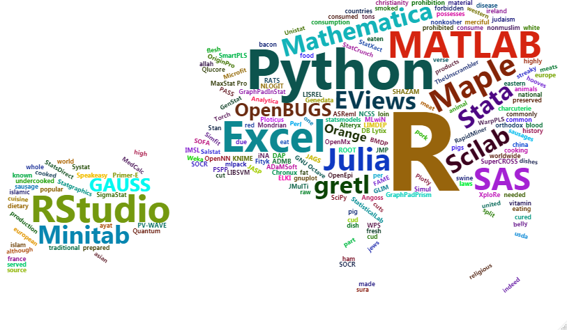

# Visualização de dados com o R {#visu}

Uma revolução na vizualização de dados aconteceu com a criação do pacote `ggplot2` de autoria de  [Hadley Wickham](https://github.com/hadley). A partir da definição de gráfico apresentada em @wilkinson2005, uma nova concepção de gráfico foi proposta em @wickham2010, que basicamente divide o gráfico em camadas que podem ser construídas por etapas. 

```{r pigb, echo=FALSE, fig.cap="Veja bem", out.width = '90%'}

```

Essa abordagem torna a construção do gráfico intuitiva e permite a criação de gráficos bonitos, padronizados, flexíveis e com poucas linhas de código. Para isso é necessário a instalação do pacote `ggplot2`.

```{r eval=FALSE}
install.packages("ggplot2")
library(ggplot2)
library(tidyverse)
```

```{r echo=FALSE,message=FALSE,warning=FALSE}
library(readxl)
idades_dietas <- read_excel("Dados/dados_idades_dietas.xlsx")
library(ggplot2)
```
 
 
 
## Gráficos com o `ggplot2`

Os gráficos do `ggplot2` são construídos camada por camada. Assim, a ideia é ir adicionando novos elementos através do operador `+`. Para exemplificar o uso do `ggplot2` vamos usar os dados de *dietas e idades*. 
<br>

```{r gbs0,fig.cap="Base de um gráfico no ggplot"}
g1=ggplot(data = idades_dietas)
g1
```

Essa é a primeira camada do gráfico gerada pela função `ggplot`. Agora novos elementos podem ser adicionados ao gráfio `g1`. 

<br>

## Funções geom e aes 

Duas funções fundamentais no conceito `ggplot` são a função `geom()` responsável pela especificação da forma geométrica utilizada no mapeamento das observações e a função `aes()` que especifica quais variáveis serão mapeadas no gráfico.

```{r gsct0,fig.cap="Scatter plot do Peso pelo Consumo"}
g1 <- g1 + geom_point(aes(x=ConsumoAcumulado, y=Peso13))
g1
```

Com a segunda camada é feita usando-se o `geom_point` a qual adiciona pontos ao gráfico `g1` de acordo com as variáveis especificadas no `aes()`.


Podemos personalizar o gráfico mexendo nas cores, lables, etc. 

```{r glb0,fig.cap="Alterando os labels do gráfico"}
g1 <- g1 + labs(x="Consumo",y="Peso Final")
g1
```
Pode-se alterar parâmetros como `colour` que muda a cor do objeto plotado,  `shape` que altera o formato do objeto plotado, `size` que determina o tamanho do objeto e `alpha` que muda a intensidade da cor.

```{r gfr0,fig.cap="Colorindo e alterando os objetos plotados",out.width=c('45%','45%'),fig.show='hold'}
ggplot(data = idades_dietas,aes(x=ConsumoAcumulado, y=Peso13))+
    geom_point(colour = "blue",  shape = 4, size = 2, alpha = 2.5)+   labs(x="Consumo",y="Peso Final")

ggplot(data = idades_dietas,aes(x=ConsumoAcumulado, y=Peso13))+
    geom_point(colour = "blue",  shape = 4, size = 8, alpha = 0.5)+   labs(x="Consumo",y="Peso Final")
```


<br>

### Estética

Com a função `aes()` (de *aesthetics*) podemos alterar a cor, tipo de gráfico, relacionar as variáveis no gráfico à fatores no conjunto de dados. Esses parâmetros também podem (recomendável) ser passados diretamente para a função `ggplot()`. Por exemplo, podemos colorir o gráfico de acordo com o fator *Dieta*.

```{r gcg0,fig.cap="Colorindo o gráfico de acordo com os níveis do fator Dieta"}
g2 <- ggplot(data=idades_dietas,aes(x=ConsumoAcumulado, y=Peso13,color=Dieta)) + 
      geom_point()+
      labs(x="Consumo",y="Peso Final")
g2
```


<br>


 Agora vamos colorir pelo fator *Grupo*.

```{r gcg,fig.cap="Colorindo o gráfico de acordo com os níveis do fator Grupo"}
g3 <- ggplot(data=idades_dietas,aes(x=ConsumoAcumulado,y=Peso13,color=Grupo)) + 
      geom_point()+
      labs(x="Consumo",y="Peso Final")
g3
```

<br>

### Curva de tendência

Uma curva de tendencia, com ou sem margem de erro, pode ser adicionada usando o metodo de regressao linear. 

<br>

```{r gsm1,out.width=c('45%','45%'),fig.show='hold',fig.cap="Gráfico com  tendência com e sem intervalo de confiânça",message=FALSE,warning=FALSE}
g2 <- g2 + geom_smooth(method = "lm", se = TRUE)
g2
g3 <- g3 + geom_smooth(method = "lm", se = FALSE)
g3
```

<br>

## Segmentação e junção de gráficos do `ggplot`


<br>

### Segmentação
Para separar o gráfico de *Peso x Consumo*, por Dieta, por exemplo, usamos a função `facet_wrap()` 

<br>

```{r gsp0,out.width=c('90%'),fig.show='hold',fig.cap="Separando gráficos de acordo com a Dieta"}
g4 <- ggplot(data=idades_dietas,aes(x=ConsumoAcumulado,y=Peso13,color=Dieta)) + 
      geom_point()+
      labs(x="Consumo",y="Peso Final")+
      facet_wrap(~ Dieta)
g4
```


<br>

### Junção de gráficos

O pacote `patchwork` facilita imensamente a junção de dois ou mais gráficos.

```{r eval=FALSE}
install.packages("patchwork")
library("patchwork")
```

```{r echo=FALSE,message=FALSE,warning=FALSE}
library("patchwork")
```

<br>

```{r gcol0,message=FALSE,warning=FALSE,fig.cap="Juntando dos gráficos de maneira fácil"}
g1 + g2 
```

<br>

Para colocar os gráfico em colunas, pode-se usar a função `plot_layout(ncol = 1)`

```{r gcol1,message=FALSE,warning=FALSE,fig.cap="Juntando dois gráficos em uma coluna"}
g3 + g4 + plot_layout(ncol = 1)
```
<br>

### Salvando um gráfico

Além da opção *export* disponível no Tools, podemos usar uma linha de comando para salvar um gráfico no diretório de trabalho. Algums opções podem ser modificadas, como  `scale`, `width` e  `height`. No seguinte exemplo, essas opções ficaram `default`. 

```{r eval=FALSE}
ggsave(filename = "meugrafico.png", plot = g4)
```


<br>

## Diferentes tipos de gráficos 

Existem várias variações da função `geom`. dentre as mais usadads podemos destacar:

- geom_abline - para retas definidas por um intercepto e uma inclinação.
- geom_hline - para retas horizontais.
- geom_boxplot - para boxplots.
- geom_density - para densidades.
- geom_area - para áreas.
- geom_bar - para barras.
- geom_histogram - para histogramas.

<br>
  
### Linhas, retas horizontais e verticais

Nesse exemplo é *plotado* inicialmente um gráfico de linhas representando a relação entre *Peso13* e *ConsumoAcumulado*. Em cima desse gráfico, foi construido retas horizontal e vertical que representam as médias das respectivas variáveis nos eixos `x` e `y`. Nesse caso, a linha horizontal em vermelho representa a média da variável *Peso13* enquanto a reta vertical em azul representa a média da variável *ConsumoAcumulado*. 

```{r gvhline,fig.cap="Linha Horizontal e linha vertical em um scatter plot conectado por linhas"}
ggplot(data=idades_dietas)+
  geom_line(aes(x=ConsumoAcumulado,y=Peso13))+
    geom_vline(aes(xintercept = mean(ConsumoAcumulado)),size=1,col='blue') +
  theme(legend.position = "none") + #remove legenda
  geom_hline(aes(yintercept = mean(Peso13)),size=1.5,col='red') 

```


<br>

### Box plot
Para fazer um box plot usa-se a função `geom_boxplot()`. Parâmetros como `fill` e `col` ajudam  a colorir o gráfico. 

```{r gbp13,out.width=c('45%','45%'),fig.show='hold',fig.cap="Box plot por Dieta e Box plot por Grupo"}
bp1=ggplot(data=idades_dietas)+
  geom_boxplot(aes(x=Dieta,y=Peso13,fill=Dieta))
bp2=ggplot(data=idades_dietas)+
  geom_boxplot(aes(x=Grupo,y=Peso13,fill=Grupo))
bp1
bp2
```

<br>

#### Legendas do Box plot

```{r lgbp1,out.width=c('45%','45%'),fig.show='hold',fig.cap="Alterando a legenda do Box plot"}
bp2+guides(fill = FALSE) #remove legenda

bp2+ scale_fill_manual(values=c("#CC9900", "#FF3399", "#CCFF00", "#339999"),name="GRUPO", labels=c("G1","G2","G3","G4"))
```

<br>


#### Escala de cinza
Em muitas situações é exigido figuras em escala cinza. Isso pode ser facilmente feito no `ggplot`. 

```{r gbp1,out.width=c('45%','45%'),fig.show='hold',fig.cap="Box plot em escala cinza"}
# Box plot
bp2 + scale_fill_grey() + theme_classic()
# Scatter plot
g2 + scale_color_grey() + theme_classic()
```

<br>

### Gráficos de barras

Gráficos de barras são interessantes paa comparar as variáeis, identificar proporções, etc. Nesse exemplo, mostramos como fazer um gráfico de barras de uma variável, separando por níveis de um fator e colorí-lo.

```{r gb1,out.width=c('45%','45%'),fig.show='hold',fig.cap="Gráfico de barras simples e gráfico de barras colorido por Dieta"}
 ggplot(data=idades_dietas, aes(x = Grupo, y = Peso13)) +
  geom_col()
ggplot(data=idades_dietas, aes(x = Grupo, y = Peso13,fill=Grupo)) +
  geom_col()
```

<br>


### Histogramas

Para construir histogramas mais elaborados no `R`, podemos usar o `ggplot` alterando oparâmetro `fill`. Ao colocarmos o parâmetro `fill=Dieta`, termeos o histograma colorido por Dieta. 


```{r dssim, echo=FALSE,message=FALSE}
library(dplyr)
source("Dados/sim_dados.R")
dados_sim=sim_dados(40,110)
```


Para esse exemplo vamos usar um banco de dados simulados especialmente para melhor visualização. 

```{r message=FALSE}
# load(dados_sim)
str(dados_sim)
```


```{r ghs1,out.width=c('45%','45%'),fig.show='hold',message=FALSE,warning=FALSE,fig.cap="Histograma simples e separado por Dieta"}

filter(dados_sim,Dias>100)%>%ggplot( aes(x = Peso)) + geom_histogram(bins=20)

filter(dados_sim,Dias>100)%>%ggplot(aes(x=Peso,fill=Dieta))+geom_histogram(bins=25)
```


<br>

### Gráfico de séries temporais

```{r gts2,out.width=c('95%'),fig.show='hold',message=FALSE,warning=FALSE,fig.cap="Desenpenho dos indivíduos ao longo do tempo, colorido por Dieta."}
dados_sim %>%
  ggplot( aes(x=Dias, y=Peso, group=Id, color=Dieta)) +
    geom_line() +
    ggtitle("Desempenho por indivíduo para diferentes dietas")
```


Para fazer o gráfico evolunido no tempo dos indivíduos somente da Dieta A, usamos o comando `pipe` para filtrar os dados. Além disso, usamos o `scale_color_discrete` para refazer a legenda do gráfico; 

```{r gts23,out.width=c('95%'),fig.show='hold',message=FALSE,warning=FALSE,fig.cap="Desenpenho dos indivíduos ao longo do tempo somente para a dieta A."}
dados_sim%>%filter(Dieta=="A")%>%ggplot( aes(x=Dias, y=Peso,group=Id,col="blue")) +
    geom_line() +
    ggtitle("Desempenho por indivíduo somente dieta A") +
    scale_color_discrete(name = "DIETA", labels = c("A"))
```

Usando o `facet_wrap()` podemos plotar o desempenho dos indivíduos ao longo do tempo, separando por Dietas.


```{r gts03,out.width=c('95%'),fig.show='hold',message=FALSE,warning=FALSE,fig.cap="Desenpenho dos indivíduos ao longo do tempo para todas as dietas em gráfico separados."}
ggplot(data=dados_sim) +
    geom_line( aes(x=Dias, y=Peso,group=Id,colour=Dieta)) +
    ggtitle("Sepando por dietas") +
     facet_wrap(~Dieta, ncol=2)
```


