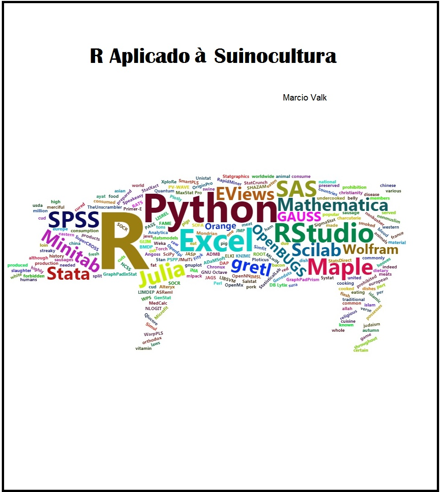
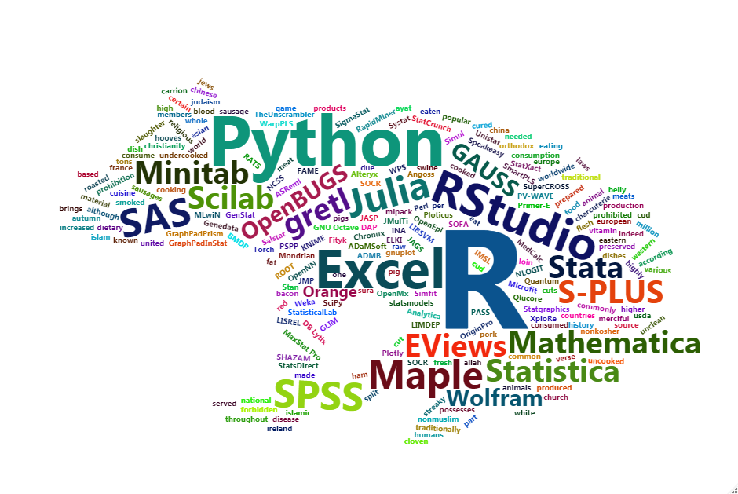

--- 
title: "R aplicado à suinocultura"
author: "Marcio Valk"
date: "`r Sys.Date()`"
bibliography:
- book.bib
- packages.bib
description: Esse material tem por objetivo dar suporte ao uso do R em análise de dados na área da suinocultura
documentclass: book
cover-image: "Figuras/cover.jpg"
link-citations: yes
site: bookdown::bookdown_site
biblio-style: apalike
geometry: margin=0.8in 
---




```{r echo=FALSE}
#para colorir frases
colorize <- function(x, color) {
  if (knitr::is_latex_output()) {
    sprintf("\\textcolor{%s}{%s}", color, x)
  } else if (knitr::is_html_output()) {
    sprintf("<span style='color: %s;'>%s</span>", color, 
      x)
  } else x
}
```

# {-}


## Objetivo {-}


A era da **_ciência de dados_** tem mudado a maneira como fazemos as coisas. A integração entre as áreas é necessária para acompanhar a dinâmica do desenvolvimento de novas tecnologias. Não é diferente na área da suinocultura, onde a realização de pesquisas têm demandado cada vez mais por ferramentas e profissionais com essa característica de _interdisciplinar_. 

O R tem se caracterizado por ser uma ferramenta completa para quem trabalha com pesquisa, seja aplicada ou teórica. As diversas áreas do conhecimento acabam convergindo para o R, por se tratar de uma linguagem moderna, dinâmica, colaborativa e integradora.

A pesquisa e o desenvolvimento tecnógico na área da suinocultura geram um volume considerável de informações que necessitam ser analisadas. O R é uma ferramenta que permite, ler, integrar e tratar grandes bancos de dados, é bem desenvolvido na área de visualização de dados e possui uma diverside de métodos estatísticos implementados. Além disso, ferramentas para gerar relatórios, apresentações e até mesmo a criação de aplicativos que possibilitam a interação do usuário final, tornam o R uma ferramenta completa. 


## Sobre o autor {-}

Meu nome é Marcio, sou professor do Departamento de Estatística da UFRGS e sou um grande fã do R. Encarei esse desafio pois gosto de pensar que outras áreas, além da Estatística, possam usufruir das fantásticas ferramentas que essa linguagem oferece. Além disso, contribuindo para o desenvolvimento tecnológio da área da suinucultura , estaremos contribuindo para o desenvolvimento do país.  


```{r cpf2, echo=FALSE, out.width = '110%'}

```


